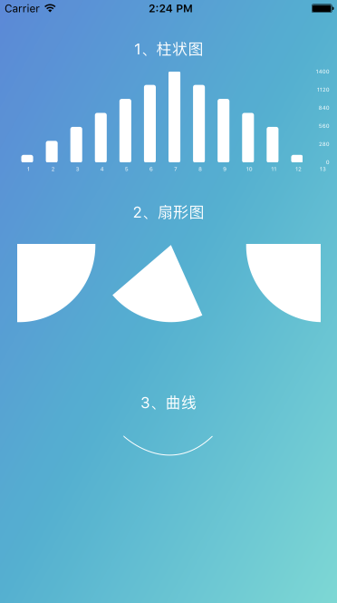

# DrawChartAndRaduis
### QuartzCore绘制 柱状图 扇形图 曲线 以及颜色渐变



## 柱状图
### self.dataList-可变数组  barColor-柱状图颜色  colorBackgroundView-自定义的view
```iOS
BarChart *barChart = [[BarChart alloc] initWithFrame:CGRectMake(10, CGRectGetMaxY(saleL.frame)+10, W_IDTH -50, 100) values:self.dataList];
barChart.barColor= [UIColor whiteColor];
[colorBackgroundView addSubview:barChart];
```

## 扇形图

```iOS
RadiusView *radiusV = [[RadiusView alloc]initWithFrame:CGRectMake(20, CGRectGetMaxY(RadiusL.frame)+20, W_IDTH -40, 120)];
radiusV.barColor= [UIColor whiteColor];
[colorBackgroundView addSubview:radiusV];
```


## 曲线
```iOS
CircleView *Circle = [[CircleView alloc]initWithFrame:CGRectMake((W_IDTH-104)/2, CGRectGetMaxY(signleL.frame)+20, 104, 200)];
Circle.barColor= [UIColor whiteColor];
[colorBackgroundView addSubview:Circle];
```
## 颜色渐变

```iOS
//背景颜色渐变
CAGradientLayer *gradientLayer = [[CAGradientLayer alloc] init];
CGColorSpaceRef colorSpaceRef = CGColorSpaceCreateDeviceRGB();
CGColorRef color1 = CGColorCreate(colorSpaceRef, (CGFloat[]){90/255.0,134/255.0,218/255.0,1.0});
CGColorRef color2 = CGColorCreate(colorSpaceRef, (CGFloat[]){80/255.0,176/255.0,210/255.0,1.0});
CGColorRef color3 = CGColorCreate(colorSpaceRef, (CGFloat[]){122/255.0,216/255.0,213/255.0,1.0});
gradientLayer.colors = @[(__bridge id)color1,(__bridge id)color2,(__bridge id)color3];
//设置颜色开始位置
gradientLayer.startPoint = CGPointMake(0, 0);
//设置颜色结束位置位置
gradientLayer.endPoint = CGPointMake(1, 1);
gradientLayer.frame = CGRectMake(0, 0, CGRectGetWidth(colorBackgroundView.frame), CGRectGetHeight(colorBackgroundView.frame));
[colorBackgroundView.layer addSublayer:gradientLayer];
```
